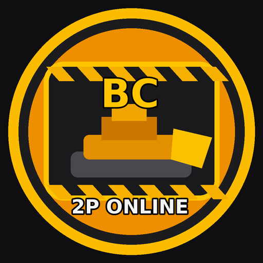
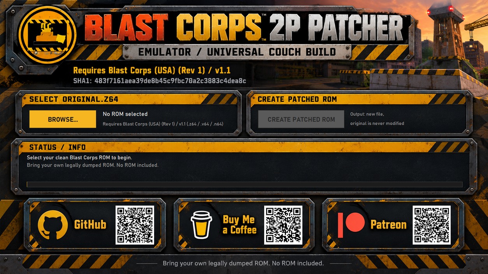

  

<h1 align="center">Blast Corps 2P</h1>

<b>Two players. One demolition job.</b>

An experimental fan-made two-player co-op mod for <i>Blast Corps</i> (Nintendo 64), 
delivered as a bring-your-own-ROM Windows patcher. Emulator / Universal Couch build.

## Download

**[Download Blast Corps 2P Patcher for Windows](https://github.com/SzebaHUN/blast-corps-2p-patcher/releases/tag/v0.1.0)**

Download `Blast-Corps-2P-Patcher-v0.1.0-Windows.zip` from **Assets**.
Do not download GitHub's automatically generated "Source code" archives.

> [!WARNING]
> **Experimental public release.** Core two-player gameplay is working, and the project is now ready for wider testing. However, the complete campaign has **not** yet been played start-to-finish in co-op. Expect bugs and mission-specific issues. Please [report anything you find](#reporting-bugs).

> [!IMPORTANT]
> **No ROM is included.** You need your own legally dumped copy of **Blast Corps (USA) (Rev 1)**. The patcher turns that ROM into the 2P version on your PC.

---

## What is Blast Corps 2P?

Blast Corps 2P puts **two players into the same Blast Corps level at the same time**.

It is not two separate campaigns, and it is not two copies of the game running side by side. Both players are in **one game simulation**:

- one world
- two player-controlled vehicles
- two controllers
- one mission
- one shared destruction state
- one shared camera

Player 1 stays in charge of the campaign. Player 2 joins as an extra demolition crew member, smashing the same buildings to clear a path for the same carrier.

## Features

- **Shared-world co-op.** Both players are in the same level and interact with the same environment. Anything either player destroys is gone for both, and both players work towards the same objectives.
- **Designed for co-op.** Players share one mission instead of playing split campaigns.
- **Player 2 vehicles.** Player 2 can use the Ramdozer, Backlash or American Dream.
- **Easy to tell apart.** Player 2's character has a blue/red colour scheme.
- **Dynamic shared camera.** The camera follows both players and pulls back as they move apart.
- **Player 1 campaign authority.** Menus, progression and saving work as in the original game.
- **Co-op-aware tutorial/dialogue.** Tutorial text can be skipped, and pressing START can recover play if something gets stuck.
- **Bring-your-own-ROM patcher.** The patcher checks your ROM, never modifies your original, and verifies its output.
- **Universal Couch support.** Remote co-op where the guest only needs a web browser (see [below](#universal-couch)).

## Player 1 and Player 2

**Player 1** is the campaign player. Player 1 controls:

- menus and level selection
- campaign progression and mission ownership
- saving
- pausing and the pause menu
- transitions and cutscenes, where appropriate

**Player 2** is a gameplay co-op actor: a second demolition vehicle in the same level. Player 2 does not own a separate campaign or save.

Player 2's current vehicle pool is:

- **Ramdozer**
- **Backlash**
- **American Dream**

The mod picks a suitable vehicle from this pool for each level. Player 2 cannot yet use every vehicle in the original game.

## Shared Camera

There is **one shared camera** that keeps track of both players:

- When the players are close together, it behaves much like the normal Blast Corps camera.
- As the players move apart, it pulls back and widens its field of view to keep both of them in view where practical.
- The zoom-out is limited, so it does not keep widening forever.

If the players get very far apart, they can go beyond what the shared camera handles well. This is a known limitation of the experimental build. Staying roughly together gives the best experience.

## Tutorial, Dialogue and Recovery

Tutorial and dialogue handling has been adapted for co-op, and tutorial text can be skipped.

Play can sometimes get stuck around tutorial, dialogue or control ownership. Where this is supported, pressing **START** hands control back to Player 1 so the game can continue. This is a recovery aid, not a guarantee that every possible softlock is avoided. If you hit one that START doesn't fix, please report it.

## Saving and Progression

Player 1 owns the normal campaign progression and save, using normal N64-style persistent saving. There are no separate Player 1 / Player 2 campaigns. Emulator savestates are not part of the mod's design. They may work in your emulator, but the mod is built around normal in-game saving.

## Current Status

**v0.1.0: experimental public test release.**

Core two-player gameplay works, and the mod has been tested across many levels during development. However, the full campaign has not yet been validated start-to-finish in co-op. You may still run into:

- mission-specific bugs
- softlocks or unusual game states
- camera edge cases, especially at long distances
- tutorial/dialogue edge cases
- vehicle-specific issues
- graphical oddities
- progression issues nobody has found yet

That is what this release is for. Wider testing helps the project become complete.

## Required ROM

| | |
|---|---|
| **Game** | Blast Corps (USA) (Rev 1), also known as v1.1 |
| **Size** | 8,388,608 bytes (8 MiB) |
| **SHA1** | `483f7161aea39de8b45c9fbc70a2c3883c4dea8c` |

`.z64`, `.v64` and `.n64` byte orders are all accepted and converted automatically. The patcher rejects any other revision, region, modified ROM or already-patched ROM.

This project does not provide ROMs or ROM download links. Please don't ask for them in issues.

## How to Patch

1. Dump your own Blast Corps (USA) (Rev 1) cartridge, or obtain a ROM of it legally.
2. Download `Blast-Corps-2P-Patcher-v0.1.0-Windows.zip` from the [release Assets](https://github.com/SzebaHUN/blast-corps-2p-patcher/releases/tag/v0.1.0), extract it, and run `BlastCorps2PPatcher.exe`.
3. Click **BROWSE...** and select your original ROM. You can also drag the ROM onto the `.exe`.
4. The patcher verifies the ROM. A supported ROM shows **VERIFIED**; anything else is rejected with the reason.
5. Click **CREATE PATCHED ROM** and choose where to save it.
6. A **new** ROM is created: `Blast Corps 2P (Emulator - Universal Couch).z64`. The patcher checks it after writing and reports **SUCCESS** with the output SHA1 `b77719799708dac1e055e457d78e05c461e8430f`.
7. Your original ROM is left untouched.

**Windows SmartScreen:** the `.exe` is not code-signed, so Windows may warn on first launch. Click *More info*, then *Run anyway*.

## Playing Locally (Emulator)

Load the patched `.z64` in an N64 emulator and connect two controllers: controller 1 is Player 1 and controller 2 is Player 2. The mod was developed and tested with **Project64** on Windows. Other emulators may work but have not been verified.

This free build is the **emulator / Universal Couch build**. It is not intended for real N64 hardware.

## Universal Couch

Blast Corps 2P is designed to work with **Universal Couch**, a companion remote couch co-op project. The host plays on their PC, and a friend joins as Player 2 from a web browser.

**Player 1 / host:**

- runs the game on their PC
- owns the ROM
- owns the save and progression
- hosts the session

**Player 2 / guest:**

- opens the session in a normal web browser
- enters the room and password
- connects a controller
- watches the game stream and sends controller input back to the host

The guest does **not** need the Blast Corps ROM, an N64 emulator, or the host's save file. The ROM and the save both stay on the host PC.

> Universal Couch is a separate project and is **not included in this repository**. This repository contains only the Blast Corps 2P patcher. A public Universal Couch link will be added here when it is available. As with any streaming setup, results depend on the network and the browser.

## Known Limitations

- The full campaign has not been co-op-tested start-to-finish yet.
- Player 2's vehicle pool is limited to the Ramdozer, Backlash and American Dream.
- Player 2 does not have campaign, menu or save ownership. This is by design.
- The shared camera can struggle when players are very far apart.
- START recovery helps with most tutorial/dialogue/control hang-ups, but not necessarily all.
- The patcher is Windows-only.
- This build targets emulators and Universal Couch.

## Reporting Bugs

Bug reports are the most useful contribution right now. Please [open an issue](https://github.com/SzebaHUN/blast-corps-2p-patcher/issues/new/choose) and use the **Gameplay bug** template if you can. Helpful details:

- **Mission/level** where it happened
- **What Player 1 was doing**
- **What Player 2 was doing**
- **Player 2's vehicle** (Ramdozer / Backlash / American Dream / on foot)
- **What happened** and **what you expected**
- **Did pressing START recover it?**
- A **screenshot or short video**, if you have one
- **Emulator / setup** (for example Project64 version, local or Universal Couch)

Please don't attach ROMs or save files to issues.

## Credits

- ***Blast Corps*** was created by **Rare** and released by **Nintendo** for the Nintendo 64 in 1997. This project exists because the game is still loved decades later. All credit for the original game goes to its creators.
- **Blast Corps 2P** co-op mod, patcher and Universal Couch: **SzebaHUN**.
- The community [Blast Corps decompilation](https://github.com/retroplastic/blastcorps) project was a valuable research reference.
- The Windows patcher bundles third-party components; see [THIRD_PARTY_NOTICES.md](THIRD_PARTY_NOTICES.md).

This is an independent fan project. It is not affiliated with, endorsed by or connected to Rare, Nintendo, Microsoft or any other rights holder.

## Support

The Emulator / Universal Couch build is free. Support is completely optional and helps fund further development and testing.

- [Buy Me a Coffee](https://buymeacoffee.com/szebahun)
- [Patreon](https://www.patreon.com/cw/SzebaHUN)
- [More projects on GitHub](https://github.com/SzebaHUN?tab=repositories)

A separate real N64 hardware build is available to Patreon supporters.

## Disclaimer

- Blast Corps 2P is an unofficial fan-made project.
- It is not affiliated with or endorsed by Nintendo, Rare, Microsoft or any other rights holder. *Blast Corps* and related names are trademarks of their respective owners.
- **No game ROM is included or distributed.** The patch contains only the changes needed to build the 2P version from your own ROM.
- You must provide your own legally obtained or dumped copy of the supported ROM.
- This is experimental software, provided as-is with no warranty. Keep a backup of your saves.
